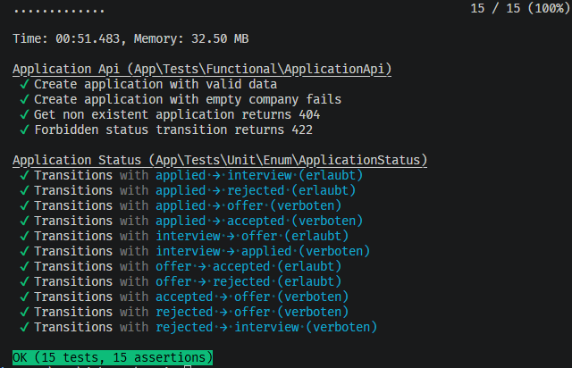

# JobTrack API

> A RESTful API to track job applications through their lifecycle — built with Symfony 7, fully containerized with Docker, and covered by automated tests.


## About this project

I built JobTrack while job-hunting for a PHP/Symfony developer role. I wanted a structured way to track my own applications — and at the same time deliberately practice the three skills that show up in almost every job posting: **Docker**, **REST API design**, and **automated testing with PHPUnit**.

The result is a small but production-minded API: it runs entirely in Docker containers, follows REST conventions with correct HTTP status codes, enforces real business logic (valid status transitions), and is backed by both unit and functional tests.

## Tech stack

- **PHP 8.3** with **Symfony 7**
- **Doctrine ORM** for persistence
- **MySQL 8** as the database
- **Nginx** + **PHP-FPM** as the web layer
- **Docker & Docker Compose** for the full environment
- **PHPUnit** for unit and functional tests

## Quickstart

The whole environment runs in Docker — no local PHP, Composer, or MySQL required. Only Docker is needed.

```bash
# 1. Clone the repository
git clone https://github.com/Aysar9/jobtrack-api.git
cd jobtrack-api

# 2. Build and start the containers
docker compose up -d --build

# 3. Set up the database
docker compose exec php php bin/console doctrine:migrations:migrate --no-interaction

# 4. (Optional) Load sample data
docker compose exec php php bin/console doctrine:fixtures:load --no-interaction
```

The API is now available at **http://localhost:8080**.

```bash
curl http://localhost:8080/api/applications
```

## API endpoints

| Method | Endpoint | Description | Success |
|--------|----------|-------------|---------|
| `GET` | `/api/applications` | List all applications (filter: `?status=interview`) | 200 |
| `GET` | `/api/applications/{id}` | Get a single application | 200 / 404 |
| `POST` | `/api/applications` | Create an application | 201 / 422 |
| `PUT` | `/api/applications/{id}` | Update an application | 200 / 422 |
| `DELETE` | `/api/applications/{id}` | Delete an application | 204 |
| `PATCH` | `/api/applications/{id}/status` | Change status (validated transition) | 200 / 422 |

### Status lifecycle

An application moves through a defined lifecycle. Only valid transitions are allowed — e.g. a `rejected` application cannot become an `offer`.

```
applied ──→ interview ──→ offer ──→ accepted
   │            │           │
   └────────────┴───────────┴──→ rejected
```

Invalid transitions are rejected with `422 Unprocessable Entity`.

## Example requests

**Create an application**

```bash
curl -X POST http://localhost:8080/api/applications \
  -H "Content-Type: application/json" \
  -d '{
    "company": "Example GmbH",
    "position": "Symfony Developer",
    "location": "Remote",
    "salaryExpectation": 48000,
    "appliedAt": "2026-07-02"
  }'
```

**Change status (valid transition)**

```bash
curl -X PATCH http://localhost:8080/api/applications/1/status \
  -H "Content-Type: application/json" \
  -d '{"status": "interview"}'
```

**Validation error response (422)**

```json
{
  "type": "https://symfony.com/errors/validation",
  "title": "Validation Failed",
  "detail": "company: This value should not be blank.",
  "violations": [
    {
      "propertyPath": "company",
      "title": "This value should not be blank."
    }
  ]
}
```

## Testing

The project is covered by **15 tests** across two levels:

- **Unit tests** — verify the status-transition business logic in isolation (no database, no HTTP), using a data provider to cover all valid and invalid transitions.
- **Functional tests** — send real HTTP requests against the endpoints and assert the response status codes, running against a separate test database.

```bash
docker compose exec php php bin/phpunit --testdox
```

<!-- TODO: Screenshot der grünen Test-Suite hier einfügen -->
<!-- Beispiel:  -->


## Architecture notes

The application runs as **three separate containers**, orchestrated with Docker Compose, following the "one container, one job" principle:

- **nginx** — accepts HTTP requests and serves static files
- **php** (PHP-FPM) — runs the Symfony application, reached by nginx over FastCGI
- **database** (MySQL) — persists data, with a named volume so data survives restarts

The services communicate over an internal Docker network by service name (e.g. the app reaches the database at host `database`, not `localhost`).

The **status-transition logic** lives directly in the `ApplicationStatus` enum as a `canTransitionTo()` method. Because it depends only on the status values themselves — no database, no external state — it is highly cohesive and trivially unit-testable. If the rules ever needed external dependencies (user roles, DB lookups), the logic would move into a dedicated service.

---

## Deutsche Kurzbeschreibung

JobTrack ist eine REST-API zum Verwalten von Bewerbungen, entstanden während meiner Jobsuche als PHP/Symfony-Entwickler. Ziel war ein realistisches Übungsprojekt für drei Kernkompetenzen aus fast jeder Stellenanzeige: **Docker**, **REST-API-Design** und **automatisierte Tests mit PHPUnit**.

Die App läuft komplett in drei Docker-Containern (Nginx, PHP-FPM, MySQL) — `docker compose up` genügt zum Starten. Ein eigener `PATCH`-Endpoint setzt eine Geschäftsregel durch: Statuswechsel sind nur entlang erlaubter Übergänge möglich (z.B. kann eine abgelehnte Bewerbung nicht zum Angebot werden). Diese Logik ist per Unit-Test abgesichert, die Endpoints per Functional-Test.

---

**Author:** Aysar Alatrash · [Portfolio](https://aysar-alatrash.de) · [GitHub](https://github.com/Aysar9)